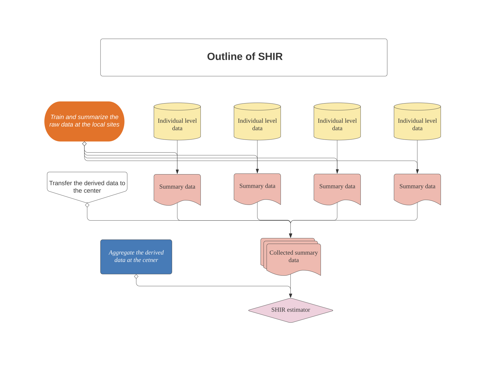

# SHIR

<!-- badges: start -->

<!-- badges: end -->

## Overview

The algorithm performs SHIR, a novel federated learning approach used
for aggregating high dimensional and heterogeneous data from local
sites, in order to obtain efficient estimators of the logistic model.
SHIR protects individual data through a summary-statistics-based
integrating procedure. At each local site, it fits LASSO to derive
summary data that is free of the individual level information.
Susequently, at the central node, it aggregates the derived statistics
at the local sites, and produces the integrative estimator.

## Background

Meta-analyzing multiple studies allows for more precise estimates and
enables investigation of generalizability. However, in the presence of
heterogeneity across studies and high dimensional predictors, such
integrative analysis is highly challenging. An major application of such
integrative analysis is to develop generalizable predictive models using
electronic health records (EHR) data from different hospitals. EHR data
is subject to high dimensional features and important privacy
constraints. The procedure SHIR protects individual data through
summary-statistics-based integrating procedure, accommodates between
study heterogeneity in both the covariate distribution and model
parameters, and attains consistent variable selection.

## Flowchart



### To derive the local individual data

At each local site m with indivdual level data (the response vector and design matrix):

<!-- D^{\sf \scriptscriptstyle (m)}=(Y^{\sf \scriptscriptstyle (m)},X^{\sf \scriptscriptstyle (m)}), -->

<a href="https://www.codecogs.com/eqnedit.php?latex=D^{\sf&space;\scriptscriptstyle&space;(m)}=(Y^{\sf&space;\scriptscriptstyle&space;(m)},X^{\sf&space;\scriptscriptstyle&space;(m)})," target="_blank"></a>

we fit lasso:

<!-- \widehat\beta_{\sf \scriptscriptstyle LASSO}^{\sf \scriptscriptstyle (m)}={\rm argmin}_{\beta}\widehat L(Y^{\sf \scriptscriptstyle (m)};X^{\sf \scriptscriptstyle (m)}\beta)+\lambda_m\|\beta_{-1}\|_1 -->

<a href="https://www.codecogs.com/eqnedit.php?latex=\widehat\beta_{\sf&space;\scriptscriptstyle&space;LASSO}^{\sf&space;\scriptscriptstyle&space;(m)}={\rm&space;argmin}_{\beta}\widehat&space;L(Y^{\sf&space;\scriptscriptstyle&space;(m)};X^{\sf&space;\scriptscriptstyle&space;(m)}\beta)&plus;\lambda_m\|\beta_{-1}\|_1," target="_blank"></a>

to obtain the summary data (the sample size, hessian matrix, and gradient):

<!-- \{n_m,\widehat H_m,\widehat g_m\},\quad\mbox{where}\quad\widehat H_m=\nabla^2\widehat L_m(\widehat\beta_{\sf \scriptscriptstyle LASSO}^{\sf \scriptscriptstyle (m)});\quad\widehat g_m=\widehat H_m\widehat\beta_{\sf \scriptscriptstyle LASSO}^{\sf \scriptscriptstyle (m)}-\nabla\widehat L_m(\widehat\beta_{\sf \scriptscriptstyle LASSO}^{\sf \scriptscriptstyle (m)}), -->


<a href="https://www.codecogs.com/eqnedit.php?latex=\{n_m,\widehat&space;H_m,\widehat&space;g_m\},\quad\mbox{where}\quad\widehat&space;H_m=\nabla^2\widehat&space;L_m(\widehat\beta_{\sf&space;\scriptscriptstyle&space;LASSO}^{\sf&space;\scriptscriptstyle&space;(m)});\quad\widehat&space;g_m=\widehat&space;H_m\widehat\beta_{\sf&space;\scriptscriptstyle&space;LASSO}^{\sf&space;\scriptscriptstyle&space;(m)}-\nabla\widehat&space;L_m(\widehat\beta_{\sf&space;\scriptscriptstyle&space;LASSO}^{\sf&space;\scriptscriptstyle&space;(m)})," target="_blank"></a>

and transfer them to the center node for integrative analysis.

### To aggregate the summary data

At the center node, we decompose the coefficients into mean effects and heterogeneous effects:

<!-- \{\mu,\alpha^{(\bullet)}\}~\mbox{where}~\alpha^{(\bullet)}=(\alpha^{\sf \scriptscriptstyle (1)},...,\alpha^{\sf \scriptscriptstyle (M)}),~\beta^{\sf \scriptscriptstyle (m)}=\mu+\alpha^{\sf \scriptscriptstyle (m)},~\alpha^{\sf \scriptscriptstyle (1)}+\cdots+\alpha^{\sf \scriptscriptstyle (M)}=0, -->

<a href="https://www.codecogs.com/eqnedit.php?latex=\{\mu,\alpha^{(\bullet)}\}~\mbox{where}~\alpha^{(\bullet)}=(\alpha^{\sf&space;\scriptscriptstyle&space;(1)},...,\alpha^{\sf&space;\scriptscriptstyle&space;(M)}),~\beta^{\sf&space;\scriptscriptstyle&space;(m)}=\mu&plus;\alpha^{\sf&space;\scriptscriptstyle&space;(m)},~\alpha^{\sf&space;\scriptscriptstyle&space;(1)}&plus;\cdots&plus;\alpha^{\sf&space;\scriptscriptstyle&space;(M)}=0," target="_blank"></a>

and fit 

<!--  -->


to obtain the SHIR estimator. Please see more details from the SHIR paper linked in the citation section.

## Installation

<!-- You can install the stable version of SHIR from [CRAN](https://CRAN.R-project.org) with: -->

<!-- ``` r -->

<!-- install.packages("SHIR") -->

<!-- ``` -->

The development version of this package can be installed from
[GitHub](https://github.com/) with:

``` r
# install.packages("devtools")
devtools::install_github("celehs/SHIR")
```

## Getting started

Follow the main steps displayed in the
[example](file:///Users/clara-lea/Documents/GitHub/SHIR/docs/articles/run_example.html),
in which we apply SHIR to a simulated dataset.

## Citation

Cai, T., Liu, M., & Xia, Y. (2021). Individual data protected
integrative regression analysis of high-dimensional heterogeneous data.
Journal of the American Statistical Association, (just-accepted), 1-34.
<https://www.tandfonline.com/doi/abs/10.1080/01621459.2021.1904958>


