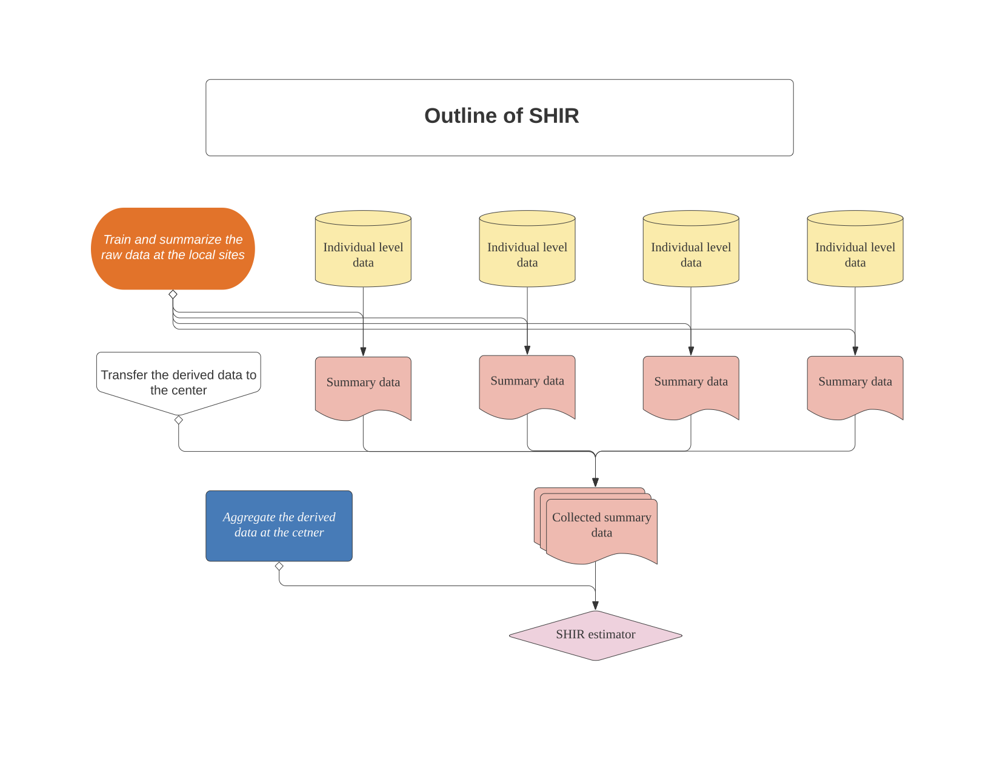

# SHIR

<!-- badges: start -->

<!-- badges: end -->

## Overview

The algorithm performs SHIR, a novel federated learning approach used
for aggregating high dimensional and heterogeneous data from local
sites, in order to obtain efficient estimators of the logistic model.
SHIR protects individual data through a summary-statistics-based
integrating procedure. At each local site, it fits LASSO to derive
summary data that is free of the individual level information.
Susequently, at the central node, it aggregates the derived statistics
at the local sites, and produces the integrative estimator.



## Installation

You can install the stable version of SHIR from
[CRAN](https://CRAN.R-project.org) with:

``` r
install.packages("SHIR")
```

And the development version from [GitHub](https://github.com/) with:

``` r
# install.packages("devtools")
devtools::install_github("celehs/SHIR")
```

## Example

``` r
library(SHIR)
## basic example code
```

## References

Cai, T., Liu, M., & Xia, Y. (2019). Individual Data Protected
Integrative Regression Analysis of High-dimensional Heterogeneous Data.
arXiv: Methodology.
